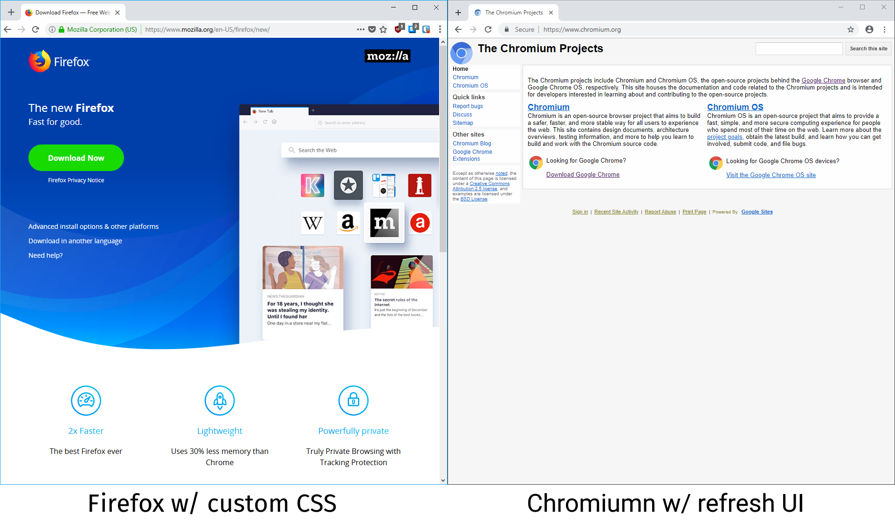
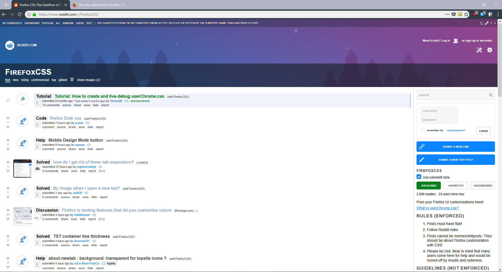
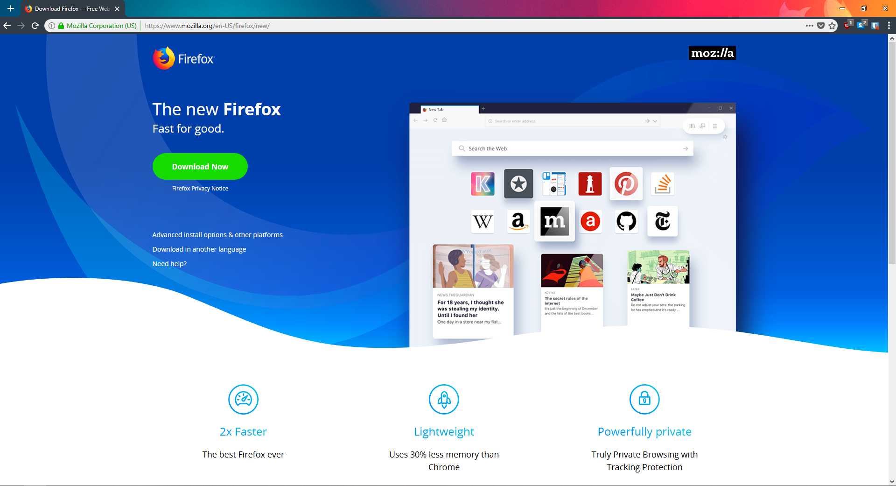

# Firefox-refreshUI

I grew quite fond of the new UI\* that's under development for Chromium/Chrome, so I decided to port it to Firefox.

\*(You can see the Chromium refresh UI for yourself by going to [chrome://flags/](chrome://flags/) in Chrome canary or the latest Chromium build and changing the `UI Layout for the browser's top chrome` flag to `refresh`)

Comparison:



The CSS is pretty close to what you can get with Chromium with similarly rounded elements.

I've also added a dark version within the CSS:



You can also use it with themes (Using mart3ll's [Quantum Theme](https://addons.mozilla.org/en-US/firefox/addon/quantum-launch/)):



## Installation

1.  Go to [about:support](about:support) in Firefox
2.  Where it says `Profile Folder`, click on the `Open Folder` button
3.  This should open your file manager in a Firefox specific directory, locate the `chrome` folder or create it if it doesn't already exist
4.  Move all the files from inside the [chrome folder in this repo](chrome) to the `chrome` folder in your Firefox folder
5.  Restart Firefox

## Configuration

I've tried to simplify the color scheme selection process so all you will have to do is change line 1 in `userChrome.css` to the theme you want. More advanced users can edit other files directly for more configuration

Change to dark theme:

```css
@import url('theme/dark.css');
```

Change to light theme:

```css
@import url('theme/light.css');
```

Change to a transparent dark theme:

```css
@import url('theme/dark-transparent.css');
```

Change to transparent light theme:

```css
@import url('theme/light-transparent.css');
```

Note: To make sure the rest of your UI that is unstyled works well with the custom CSS, use the integrated dark theme when using `dark.css` and the integrated light theme when using `light.css`. For Firefox Addon themes, test both `dark-transparent.css` and `light-transparent.css` to see which works better.

## Uninstall

Delete the `chrome` folder within your Firefox folder

## Support

I have only tested this theme on Firefox Developer Edition 61.0b12 on Windows 10-1803. It may require extra tweaks to work on different versions of Firefox or different operating systems.

If you have questions, problems, or want to contribute, please [submit an issue here](https://github.com/mnxn/Firefox-refreshUI/issues/new) or a [pull request here](https://github.com/mnxn/firefox-refreshUI/compare).
